---
## Front matter
lang: ru-RU
title: Выполнение упражнения
subtitle: "Построение с помощью xcos фигуры Лиссажу с различными значениями параметров"
author:
  - Чемоданова Ангелина Александровна
teacher:
  - Кулябов Д. С.
  - д.ф.-м.н., профессор
  - профессор кафедры теории вероятностей и кибербезопасности 
institute:
  - Российский университет дружбы народов имени Патриса Лумумбы, Москва, Россия
date: 25 февраля 2025

## i18n babel
babel-lang: russian
babel-otherlangs: english

## Formatting pdf
toc: false
toc-title: Содержание
slide_level: 2
aspectratio: 169
section-titles: true
theme: metropolis
header-includes:
 - \metroset{progressbar=frametitle,sectionpage=progressbar,numbering=fraction}
---

## Докладчик

:::::::::::::: {.columns align=center}
::: {.column width="70%"}

  * Чемоданова Ангелина Александровна
  * Cтудентка НФИбд02-22
  * Российский университет дружбы народов имени Патриса Лумумбы
  * [1132226443@pfur.ru](mailto:1132226443@pfur.ru)
  * <https://github.com/aachemodanova>

:::
::: {.column width="30%"}

:::
::::::::::::::

## Цель работы

Выполнить упражнение по построению фигуры Лиссажу с помощью программы *xcos*.

## Задание

Постройте с помощью xcos фигуры Лиссажу со следующими параметрами:

1) $A = B = 1, a = 2, b = 2, \, \delta = 0; \, \pi/4; \, \pi/2; \,  3\pi/4;\,  \pi;$

2) $A = B = 1, a = 2, b = 4, \, \delta = 0; \, \pi/4; \, \pi/2; \, 3\pi/4; \, \pi;$

3) $A = B = 1, a = 2, b = 6, \, \delta = 0; \, \pi/4; \, \pi/2; \, 3π/4; \, π;$

4) $A = B = 1, a = 2, b = 3, \, \delta = 0; \, \pi/4; \, \pi/2; \, 3\pi/4; \, \pi.$

# Выполнение лабораторной работы

## Математическая модель

Математическое выражение для кривой Лиссажу:
$$
\begin{cases}
  x(t) = A * sin(a * t + \delta),\\
  y(t) = B * sin(b * t),
\end{cases}
$$
где $A, B$ -- амплитуды колебаний, $a, b$ -- частоты, $\delta$ -- сдвиг фаз.

## Реализация модели в xcos

В модели использованы следующие блоки xcos:
- CLOCK_c -- запуск часов модельного времени;
- GENSIN_f -- блок генератора синусоидального сигнала;
- CSOPXY -- анимированное регистрирующее устройство для построения графика типа y = f(x);
- TEXT_f -- задаёт текст примечаний.

{#fig:001 width=30%}

## Ввод параметров для регистрирующего устройства

Настроим параметры регистрирующего устройства. 

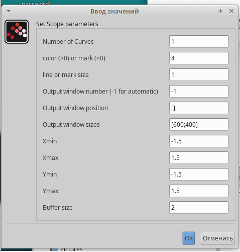{#fig:002 width=40%}

## Ввод параметров для генераторов синусоидального сигнала

Настроим параметры генераторов синусоидального сигнала.

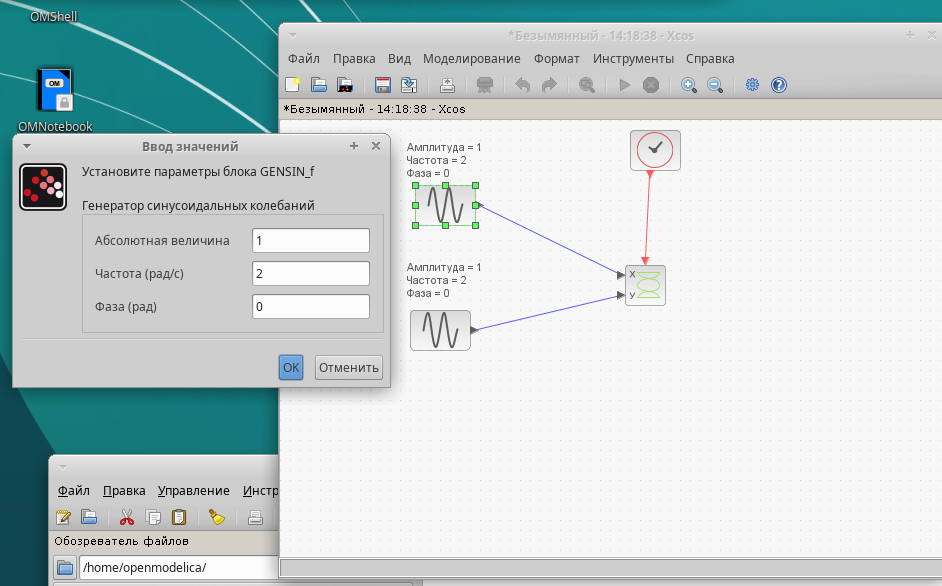{#fig:003 width=70%}

## Построение фигуры Лиссажу при параметрах: $A = B = 1, a = 2, b = 2$

Перейдем к построению. Получим график фигуры Лиссажу при параметрах: $A = B = 1, a = 2, b = 2, \delta = 0$ 

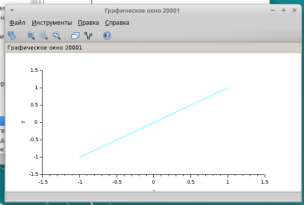{#fig:004 width=50%}

## Построение фигуры Лиссажу при параметрах: $A = B = 1, a = 2, b = 2$

Изменим фазу в первом генераторе на $\pi/4; \, \pi/2; \,  3\pi/4;\,  \pi;$ получим соответственно другие фигуры Лиссажу.

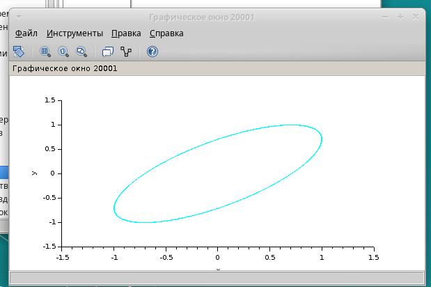{#fig:005 width=50%}

## Построение фигуры Лиссажу при параметрах: $A = B = 1, a = 2, b = 2$

{#fig:006 width=70%}

## Построение фигуры Лиссажу при параметрах: $A = B = 1, a = 2, b = 2$

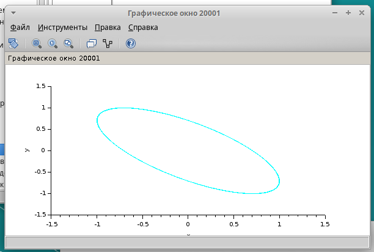{#fig:007 width=70%}

## Построение фигуры Лиссажу при параметрах: $A = B = 1, a = 2, b = 2$

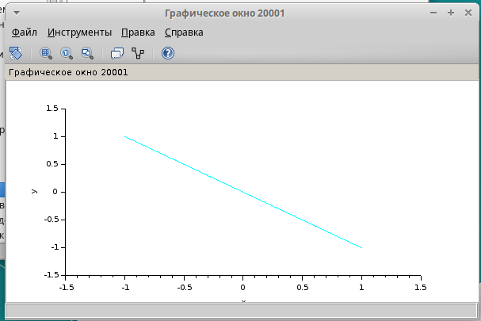{#fig:008 width=70%}

## Построение фигуры Лиссажу при параметрах: $A = B = 1, a = 2, b = 4$

Изменим частоту на 4(рад/c) на втором генераторе синусоидального сигнала. 

{#fig:009 width=30%}

## Построение фигуры Лиссажу при параметрах: $A = B = 1, a = 2, b = 4$

Перейдем к построению. Получим график фигуры Лиссажу при параметрах: $A = B = 1, a = 2, b = 4, \delta = 0$ 

{#fig:010 width=50%}

## Построение фигуры Лиссажу при параметрах: $A = B = 1, a = 2, b = 4$

Изменим фазу в первом генераторе на $\pi/4; \, \pi/2; \,  3\pi/4;\,  \pi;$ получим соответственно другие фигуры Лиссажу 

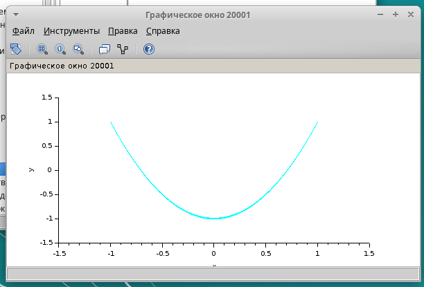{#fig:011 width=50%}

## Построение фигуры Лиссажу при параметрах: $A = B = 1, a = 2, b = 4$

{#fig:012 width=70%}

## Построение фигуры Лиссажу при параметрах: $A = B = 1, a = 2, b = 4$

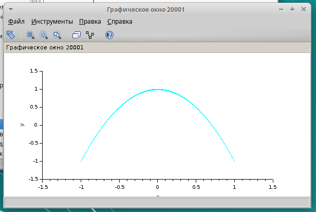{#fig:013 width=70%}

## Построение фигуры Лиссажу при параметрах: $A = B = 1, a = 2, b = 4$

{#fig:014 width=70%}

## Построение фигуры Лиссажу при параметрах: $A = B = 1, a = 2, b = 6$

Изменим частоту на 6(рад/c) на втором генераторе синусоидального сигнала. 

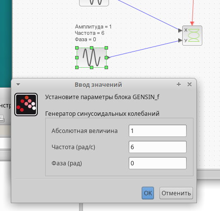{#fig:015 width=30%}

## Построение фигуры Лиссажу при параметрах: $A = B = 1, a = 2, b = 6$

Перейдем к построению. Получим график фигуры Лиссажу при параметрах: $A = B = 1, a = 2, b = 6, \delta = 0$ 

{#fig:016 width=50%}

## Построение фигуры Лиссажу при параметрах: $A = B = 1, a = 2, b = 6$

Изменим фазу в первом генераторе на $\pi/4; \, \pi/2; \,  3\pi/4;\,  \pi;$ получим соответственно другие фигуры Лиссажу.

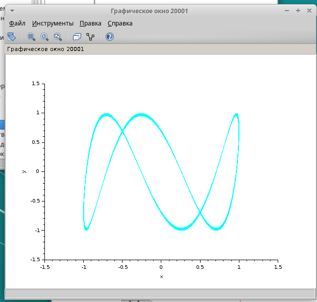{#fig:017 width=50%}

## Построение фигуры Лиссажу при параметрах: $A = B = 1, a = 2, b = 6$

{#fig:018 width=70%}

## Построение фигуры Лиссажу при параметрах: $A = B = 1, a = 2, b = 6$

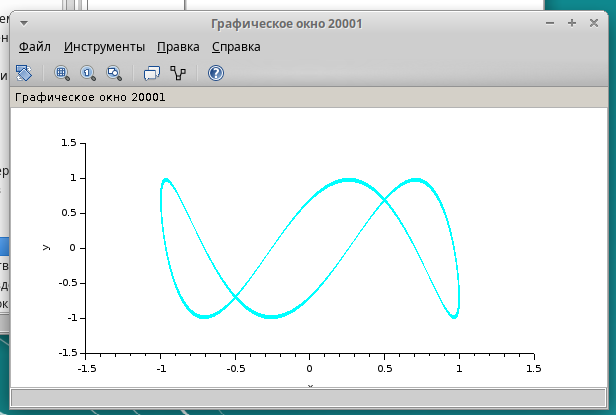{#fig:019 width=70%}

## Построение фигуры Лиссажу при параметрах: $A = B = 1, a = 2, b = 6$

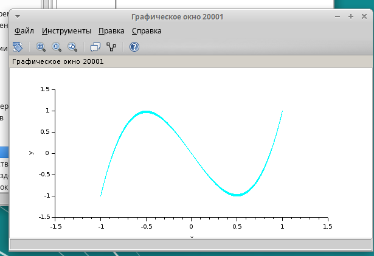{#fig:020 width=70%}

## Построение фигуры Лиссажу при параметрах: $A = B = 1, a = 2, b = 3$

Изменим частоту на 3(рад/c) на втором генераторе синусоидального сигнала. 

{#fig:021 width=30%}

## Построение фигуры Лиссажу при параметрах: $A = B = 1, a = 2, b = 3$

Перейдем к построению. Получим график фигуры Лиссажу при параметрах: $A = B = 1, a = 2, b = 3, \delta = 0$ 

{#fig:022 width=50%}

## Построение фигуры Лиссажу при параметрах: $A = B = 1, a = 2, b = 3$

Изменим фазу в первом генераторе на $\pi/4; \, \pi/2; \,  3\pi/4;\,  \pi;$ получим соответственно другие фигуры Лиссажу.

{#fig:023 width=30%}

## Построение фигуры Лиссажу при параметрах: $A = B = 1, a = 2, b = 3$

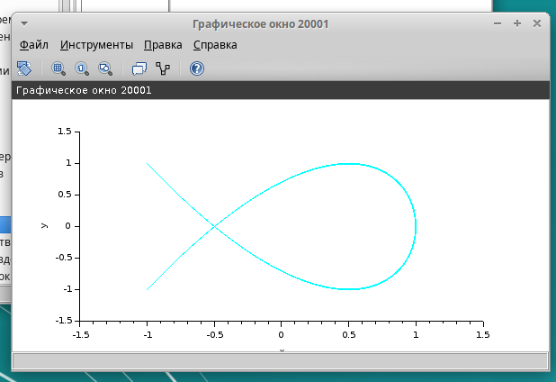{#fig:024 width=70%}

## Построение фигуры Лиссажу при параметрах: $A = B = 1, a = 2, b = 3$

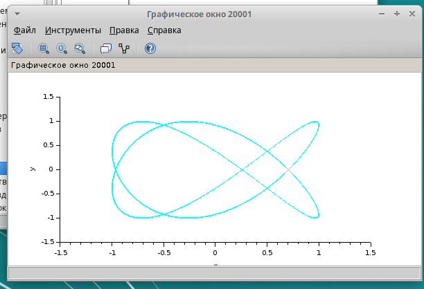{#fig:025 width=70%}

## Построение фигуры Лиссажу при параметрах: $A = B = 1, a = 2, b = 3$

{#fig:026 width=70%}

## Выводы

Мы выполнили упражнение по построению фигуры Лиссажу с помощью программы *xcos*.
