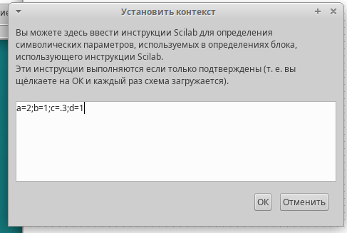
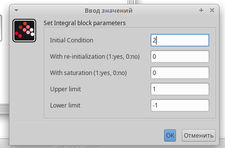
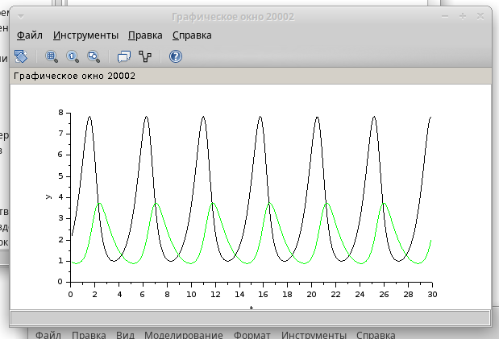
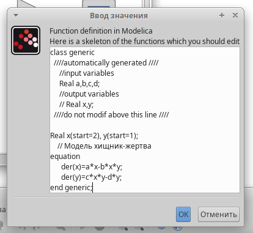
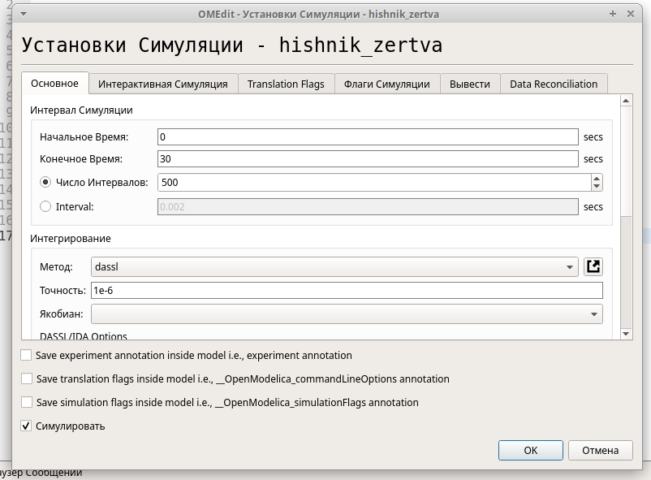
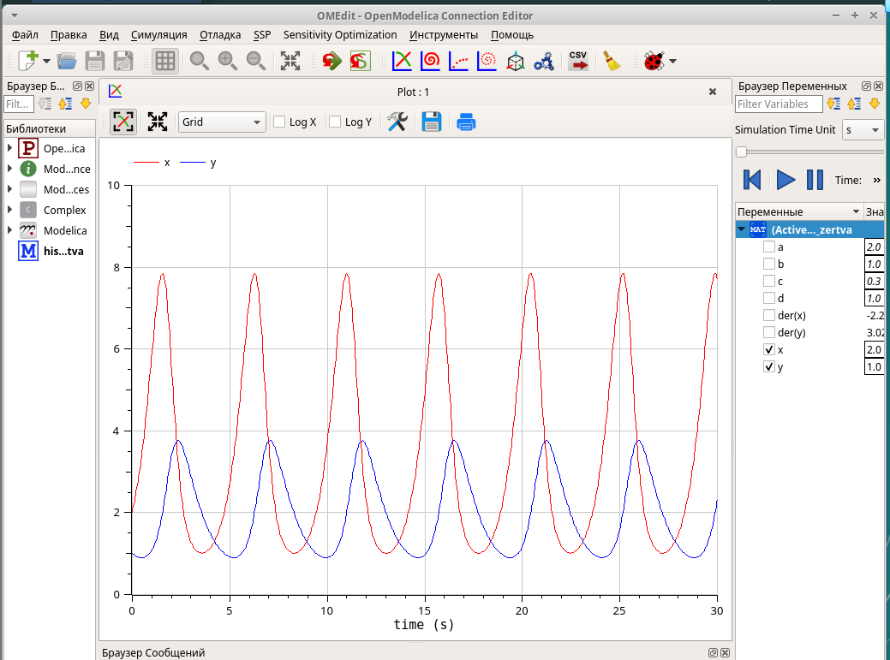
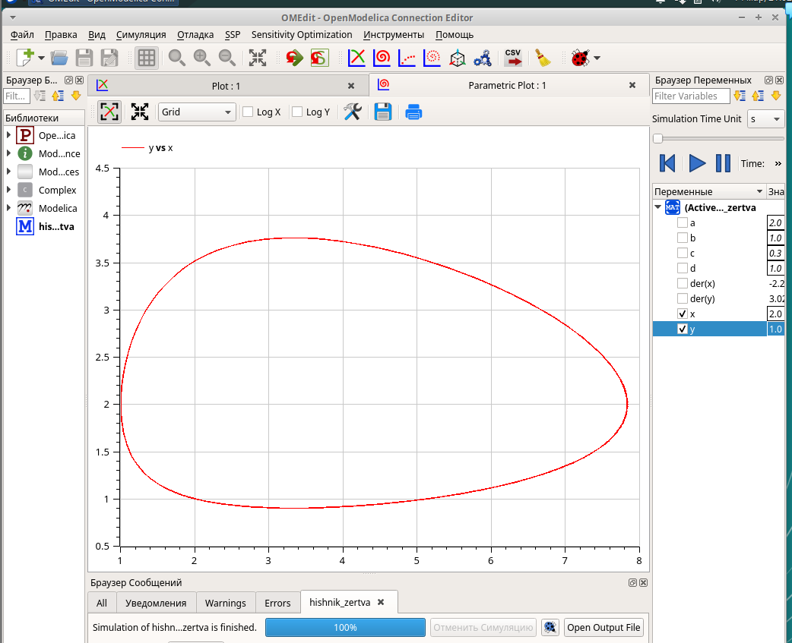

---
## Front matter
lang: ru-RU
title: Лабораторная работа №6
subtitle: "Модель 'хищник-жертва'"
author:
  - Чемоданова Ангелина Александровна
teacher:
  - Кулябов Д. С.
  - д.ф.-м.н., профессор
  - профессор кафедры теории вероятностей и кибербезопасности 
institute:
  - Российский университет дружбы народов имени Патриса Лумумбы, Москва, Россия
date: 14 марта 2025

## i18n babel
babel-lang: russian
babel-otherlangs: english

## Formatting pdf
toc: false
toc-title: Содержание
slide_level: 2
aspectratio: 169
section-titles: true
theme: metropolis
header-includes:
 - \metroset{progressbar=frametitle,sectionpage=progressbar,numbering=fraction}
---

## Докладчик

:::::::::::::: {.columns align=center}
::: {.column width="70%"}

  * Чемоданова Ангелина Александровна
  * Cтудентка НФИбд02-22
  * Российский университет дружбы народов имени Патриса Лумумбы
  * [1132226443@pfur.ru](mailto:1132226443@pfur.ru)
  * <https://github.com/aachemodanova>

:::
::: {.column width="30%"}

:::
::::::::::::::

## Цель работы

Исследовать модель "хищник-жертва" с помощью программы *xcos* и OpenModelica.

## Задание

- рассмотреть модель "хищник-жертва" в xcos;
- рассмотреть модель "хищник-жертва" в xcos с использованием блока Modelica;
- рассмотреть модель "хищник-жертва" в OpenModelica.

## Математическая модель

Модель «хищник–жертва» (модель Лотки — Вольтерры) представляет собой модель межвидовой конкуренции. В математической форме модель имеет вид:

$$
\begin{cases}
  \dot x = ax - bxy \\
  \dot y = cxy - dy,
\end{cases}
$$

где $x$ — количество жертв; $y$ — количество хищников; $a, b, c, d$ — коэффициенты, отражающие взаимодействия между видами: $a$ — коэффициент рождаемости жертв; $b$ — коэффициент убыли жертв; $c$ — коэффициент рождения хищников; $d$ — коэффициент убыли хищников.

## Реализация модели в xcos

В меню Моделирование, Задать переменные окружения зададим значения переменных.

{#fig:001 width=50%}

## Реализация модели в xcos

Для реализации модели в дополнение к блокам CLOCK_c, CSCOPE, TEXT_f, MUX, INTEGRAL_m, GAINBLK_f, SUMMATION, PROD_f потребуется блок CSCOPXY — регистрирующее устройство для построения фазового портрета.

{#fig:002 width=40%}

## Реализация модели в xcos

{#fig:003 width=70%}

## Реализация модели в xcos

{#fig:004 width=70%}

## Реализация модели в xcos

Зададим конечное время интегрирования.

{#fig:005 width=70%}

## Реализация модели в xcos

{#fig:006 width=60%} 

## Реализация модели в xcos

{#fig:007 width=70%} 

## Реализация модели с помощью блока Modelica в xcos

Для реализации модели с помощью языка Modelica потребуются следующие
блоки *xcos*: `CLOCK_c`, `CSCOPE`, `CSCOPXY`, `TEXT_f`, `MUX`, `CONST_m` и `MBLOCK` (Modelica generic).
Как и ранее, задаём значения коэффициентов $a, b, c, d$.

{#fig:008 width=45%} 

## Реализация модели с помощью блока Modelica в xcos

{#fig:009 width=50%}

## Реализация модели с помощью блока Modelica в xcos

{#fig:010 width=50%}

## Реализация модели с помощью блока Modelica в xcos

{#fig:011 width=70%} 

## Реализация модели с помощью блока Modelica в xcos

{#fig:012 width=45%} 

## Реализация модели "хищник-жертва" в OpenModelica

Создадим файл модели, зададим дифференциальные уравнения и присвоим переменным значения.

{#fig:013 width=50%} 

## Реализация модели "хищник-жертва" в OpenModelica

{#fig:014 width=50%} 

## Реализация модели "хищник-жертва" в OpenModelica

{#fig:015 width=50%} 

## Реализация модели "хищник-жертва" в OpenModelica

{#fig:016 width=50%} 

# Выводы

Мы исследовали модель "хищник-жертва" с помощью программы *xcos* и OpenModelica.
