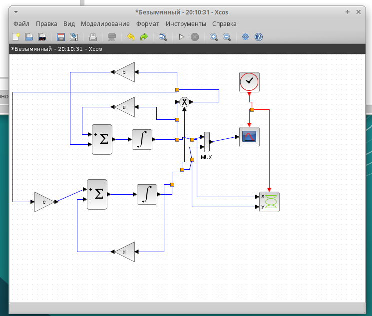
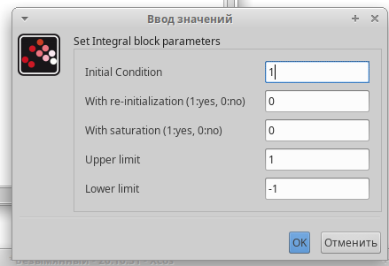
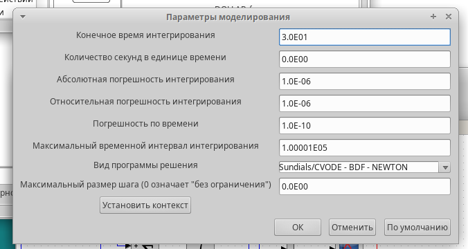
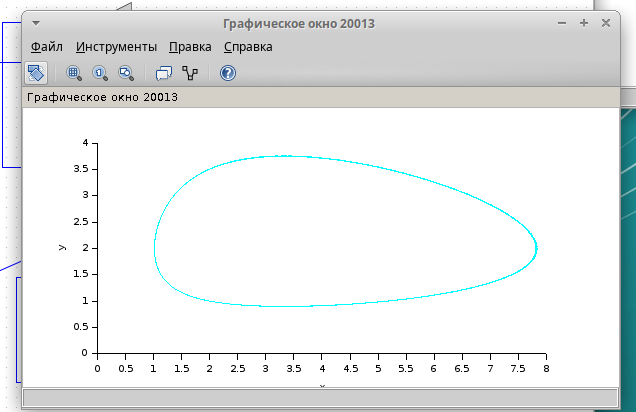
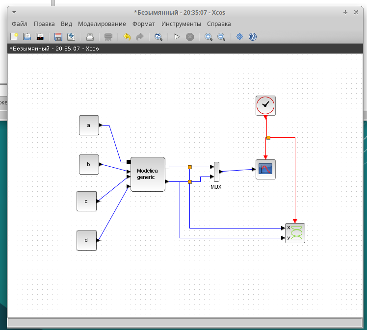
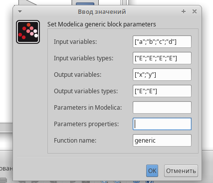
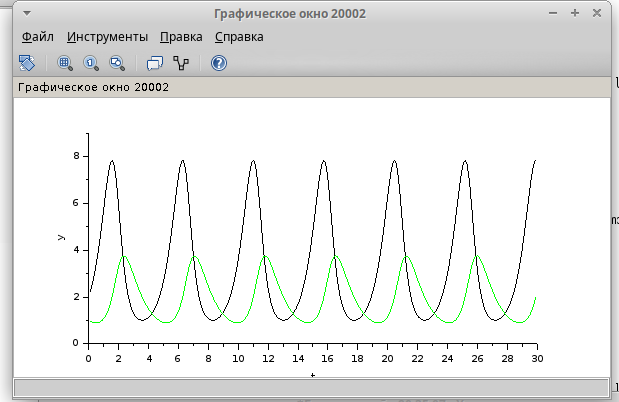
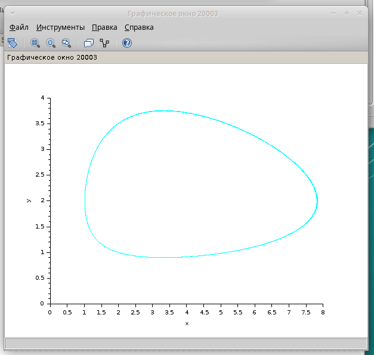
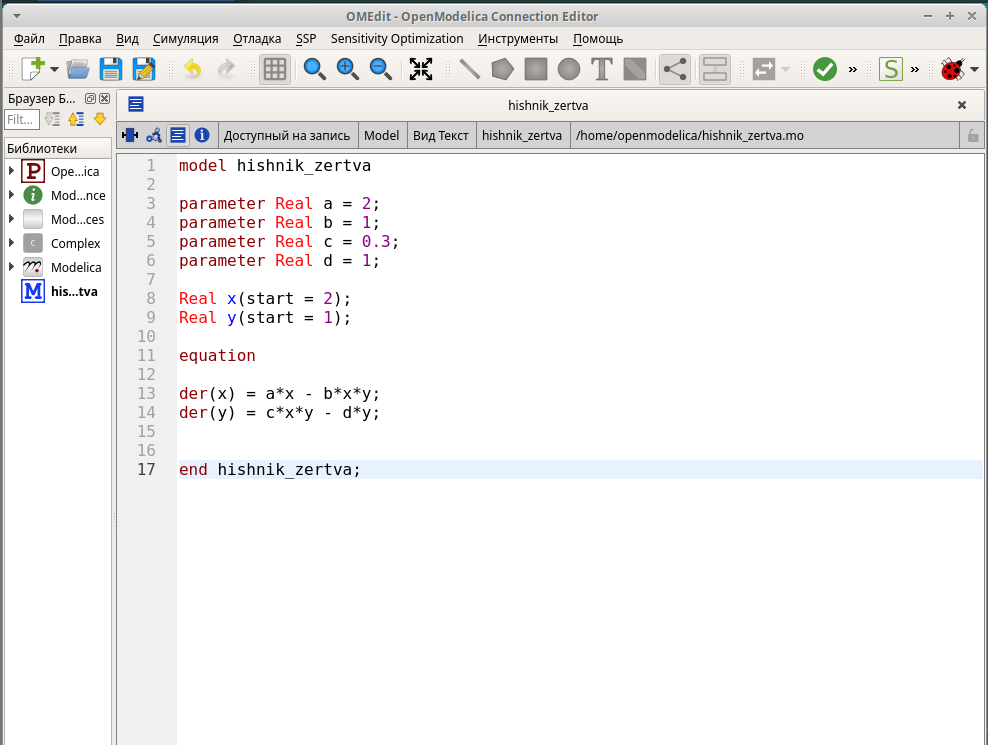

---
## Front matter
title: "Лабораторная работа №6"
subtitle: "Модель 'хищник-жертва'"
author: "Чемоданова Ангелина Александровна"

## Generic otions
lang: ru-RU
toc-title: "Содержание"

## Bibliography
bibliography: bib/cite.bib
csl: pandoc/csl/gost-r-7-0-5-2008-numeric.csl

## Pdf output format
toc: true # Table of contents
toc-depth: 2
lof: true # List of figures
lot: false # List of tables
fontsize: 12pt
linestretch: 1.5
papersize: a4
documentclass: scrreprt
## I18n polyglossia
polyglossia-lang:
  name: russian
  options:
	- spelling=modern
	- babelshorthands=true
polyglossia-otherlangs:
  name: english
## I18n babel
babel-lang: russian
babel-otherlangs: english
## Fonts
mainfont: IBM Plex Serif
romanfont: IBM Plex Serif
sansfont: IBM Plex Sans
monofont: IBM Plex Mono
mathfont: STIX Two Math
mainfontoptions: Ligatures=Common,Ligatures=TeX,Scale=0.94
romanfontoptions: Ligatures=Common,Ligatures=TeX,Scale=0.94
sansfontoptions: Ligatures=Common,Ligatures=TeX,Scale=MatchLowercase,Scale=0.94
monofontoptions: Scale=MatchLowercase,Scale=0.94,FakeStretch=0.9
mathfontoptions:
## Biblatex
biblatex: true
biblio-style: "gost-numeric"
biblatexoptions:
  - parentracker=true
  - backend=biber
  - hyperref=auto
  - language=auto
  - autolang=other*
  - citestyle=gost-numeric
## Pandoc-crossref LaTeX customization
figureTitle: "Рис."
tableTitle: "Таблица"
listingTitle: "Листинг"
lofTitle: "Список иллюстраций"
lotTitle: "Список таблиц"
lolTitle: "Листинги"
## Misc options
indent: true
header-includes:
  - \usepackage{indentfirst}
  - \usepackage{float} # keep figures where there are in the text
  - \floatplacement{figure}{H} # keep figures where there are in the text
---

# Цель работы

Исследовать модель "хищник-жертва" с помощью программы *xcos* и OpenModelica.

# Задание

- рассмотреть модель "хищник-жертва" в xcos;
- рассмотреть модель "хищник-жертва" в xcos с использованием блока Modelica;
- рассмотреть модель "хищник-жертва" в OpenModelica[@xs].

# Выполнение лабораторной работы

## Математическая модель

Модель «хищник–жертва» (модель Лотки — Вольтерры) представляет собой модель межвидовой конкуренции. В математической форме модель имеет вид:

$$
\begin{cases}
  \dot x = ax - bxy \\
  \dot y = cxy - dy,
\end{cases}
$$

где $x$ — количество жертв; $y$ — количество хищников; $a, b, c, d$ — коэффициенты, отражающие взаимодействия между видами: $a$ — коэффициент рождаемости жертв; $b$ — коэффициент убыли жертв; $c$ — коэффициент рождения хищников; $d$ — коэффициент убыли хищников[@Mod].

## Реализация модели в xcos

В меню Моделирование, Задать переменные окружения зададим значения переменных. (рис. [-@fig:001]).

{#fig:001 width=70%}

Для реализации модели, изображённой на рис. [-@fig:002], в дополнение к блокам CLOCK_c, CSCOPE, TEXT_f, MUX, INTEGRAL_m, GAINBLK_f, SUMMATION, PROD_f потребуется блок CSCOPXY — регистрирующее устройство для построения фазового портрета.

{#fig:002 width=70%}

Первое уравнение модели задано верхним блоком интегрирования, блоком произведения и блоками задания коэффициентов a и b. 

Второе уравнение модели задано нижним блоком интегрирования и блоками задания коэффициентов c и d. 

Для суммирования слагаемых правых частей уравнений используем блоки
суммирования с соответствующими знаками перед коэффициентами. Выходы блоков суммирования соединяем с входами блоков интегрирования. Выходы блоков интегрирования соединяем с мультиплексором, который в свою очередь позволяет вывести на один график сразу обе кривые: динамику численности жертв и динамику численности хищников.

Зададим начальные значения в блоках интегрирования.  (рис. [-@fig:003], [-@fig:004]).

{#fig:003 width=70%}

{#fig:004 width=70%}

Зададим конечное время интегрирования. (рис. [-@fig:005]).

{#fig:005 width=70%}

Динамика изменения численности хищников и жертв при $a = 2$, $b = 1$, $c = 0.3$, $d = 1$, $x(0) = 2$, $y(9) = 1$ в xcos. (рис. [-@fig:006]).

{#fig:006 width=70%} 

Фазовый портрет модели "хищник-жертва" при $a = 2$, $b = 1$, $c = 0.3$, $d = 1$, $x(0) = 2$, $y(9) = 1$. (рис. [-@fig:007]).

{#fig:007 width=70%} 

## Реализация модели с помощью блока Modelica в xcos

Для реализации модели с помощью языка Modelica потребуются следующие
блоки *xcos*: `CLOCK_c`, `CSCOPE`, `CSCOPXY`, `TEXT_f`, `MUX`, `CONST_m` и `MBLOCK` (Modelica generic).
Как и ранее, задаём значения коэффициентов $a, b, c, d$ (см. рис. [-@fig:001]).

Модель «хищник–жертва» в xcos с применением блока Modelica. (рис. [-@fig:008])

{#fig:008 width=70%} 

Параметры блока Modelica для модели "хищник-жертва". (рис. [-@fig:009], [-@fig:010]).

{#fig:009 width=70%}

{#fig:010 width=70%}

Динамика изменения численности хищников и жертв при $a = 2$, $b = 1$, $c = 0.3$, $d = 1$, $x(0) = 2$, $y(9) = 1$ в xcos с помощью блока Modelica. (рис. [-@fig:011]).

{#fig:011 width=70%} 

Фазовый портрет модели "хищник-жертва" при $a = 2$, $b = 1$, $c = 0.3$, $d = 1$, $x(0) = 2$, $y(9) = 1$ в xcos с помощью блока Modelica. (рис. [-@fig:012]).

{#fig:012 width=70%} 

## Реализация модели "хищник-жертва" в OpenModelica

Создадим файл модели, зададим дифференциальные уравнения и присвоим переменным значения. (рис. [-@fig:013]).

{#fig:013 width=70%} 

Зададим интервал симуляции. (рис. [-@fig:014]).

{#fig:014 width=70%} 

Динамика изменения численности хищников и жертв при $a = 2$, $b = 1$, $c = 0.3$, $d = 1$, $x(0) = 2$, $y(9) = 1$ в OpenModelica. (рис. [-@fig:015]).

{#fig:015 width=70%} 

Фазовый портрет модели "хищник-жертва" при $a = 2$, $b = 1$, $c = 0.3$, $d = 1$, $x(0) = 2$, $y(9) = 1$ в OpenModelica. (рис. [-@fig:016]).

{#fig:016 width=70%} 

# Выводы

Мы исследовали модель "хищник-жертва" с помощью программы *xcos* и OpenModelica.

# Список литературы{.unnumbered}

::: {#refs}
:::
