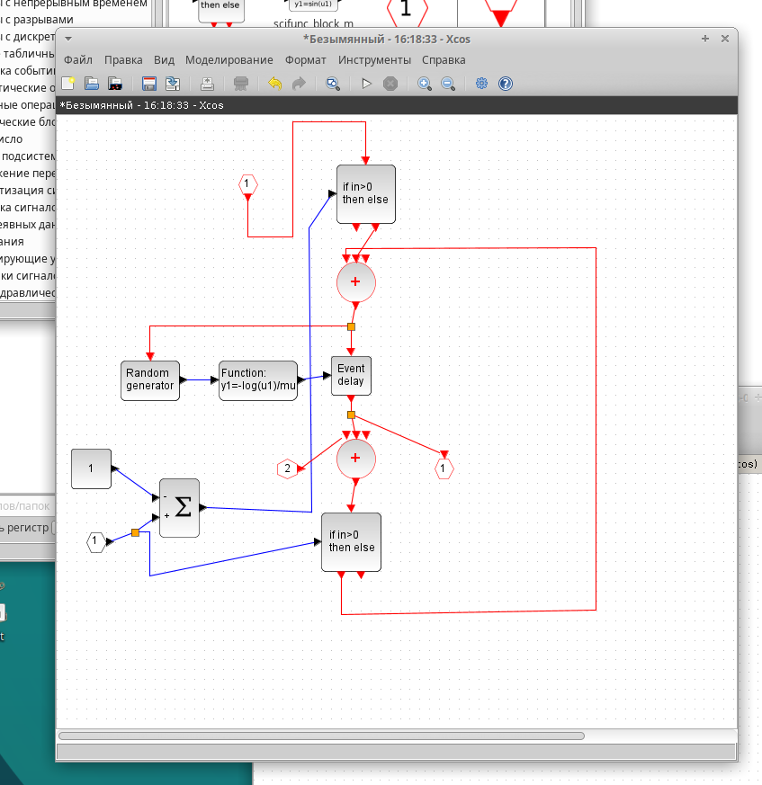
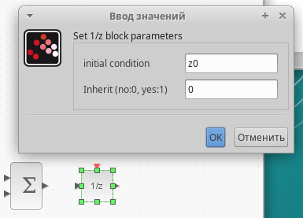
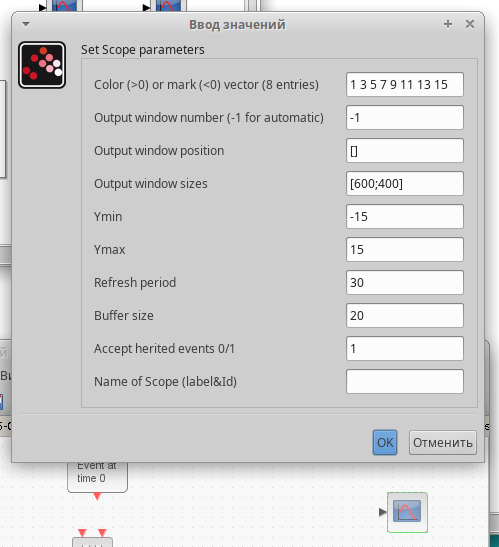
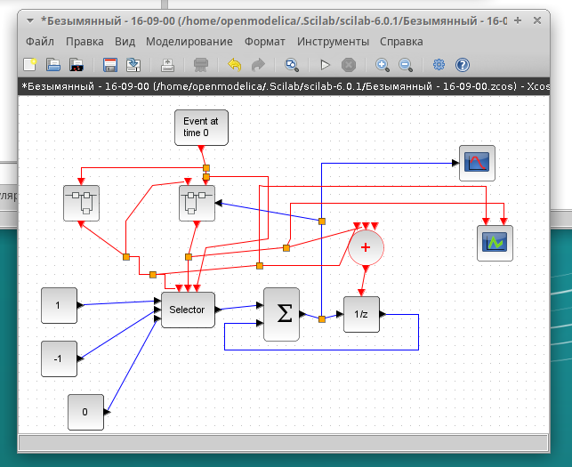
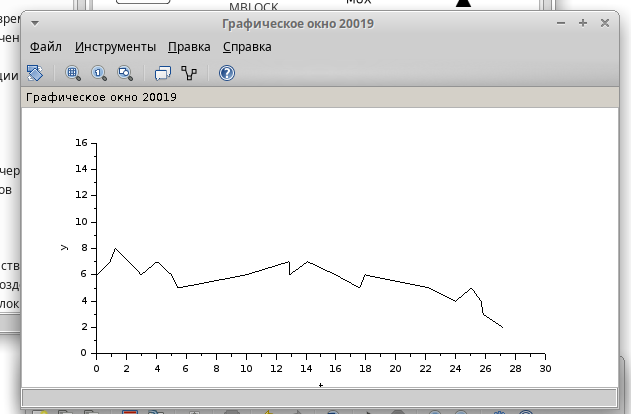

---
## Front matter
lang: ru-RU
title: Лабораторная работа №7
subtitle: "Модель M/M/1/"
author:
  - Чемоданова Ангелина Александровна
teacher:
  - Кулябов Д. С.
  - д.ф.-м.н., профессор
  - профессор кафедры теории вероятностей и кибербезопасности 
institute:
  - Российский университет дружбы народов имени Патриса Лумумбы, Москва, Россия
date: 15 марта 2025

## i18n babel
babel-lang: russian
babel-otherlangs: english

## Formatting pdf
toc: false
toc-title: Содержание
slide_level: 2
aspectratio: 169
section-titles: true
theme: metropolis
header-includes:
 - \metroset{progressbar=frametitle,sectionpage=progressbar,numbering=fraction}
---

## Докладчик

:::::::::::::: {.columns align=center}
::: {.column width="70%"}

  * Чемоданова Ангелина Александровна
  * Cтудентка НФИбд02-22
  * Российский университет дружбы народов имени Патриса Лумумбы
  * [1132226443@pfur.ru](mailto:1132226443@pfur.ru)
  * <https://github.com/aachemodanova>

:::
::: {.column width="30%"}

:::
::::::::::::::

## Цель работы

Исследовать модель Модель M/M/1/$\infty$ с помощью программы *xcos*.

## Задание

- рассмотреть модель M/M/1/$\infty$ в xcos;
- построить график поступления и обработки заявок;
- построить график димамики размера очереди.

## Теоретическая часть

M|M|1|$\infty$ — однолинейная СМО с накопителем бесконечной ёмкости. Поступающий поток заявок — пуассоновский с интенсивностью λ. Времена обслуживания заявок — независимые в совокупности случайные величины, распределённые по экспоненциальному закону с параметром µ. Рассмотрим реализацию данной модели с параметрами системы: lambda = 0.3 mu = 0.35.

## Ввод переменных окружения

В меню Моделирование, Задать переменные окружения зададим значения переменных.

{#fig:001 width=50%}

## Суперблок, моделирующий поступление заявок

Для реализации модели создадим суперблок моделирования поступления заявок в систему по пуассоновскому закону.

{#fig:002 width=70%}

## Суперблок, моделирующий обработку заявок

{#fig:003 width=45%}

## Суперблок, моделирующий обработку заявок

{#fig:004 width=70%}

## Реализуем готовую модель M|M|1|$\infty$ в *xcos* 

{#fig:005 width=60%}

## Реализуем готовую модель M|M|1|$\infty$ в *xcos* 

{#fig:006 width=40%}

## Реализуем готовую модель M|M|1|$\infty$ в *xcos* 

{#fig:007 width=50%}

## Реализуем готовую модель M|M|1|$\infty$ в *xcos* 

{#fig:008 width=50%}

## Результат моделирования

{#fig:009 width=70%}

## Динамика размера очереди

{#fig:010 width=70%}

## Выводы

Мы исследовали модель Модель M/M/1/$\infty$ с помощью программы *xcos*.
