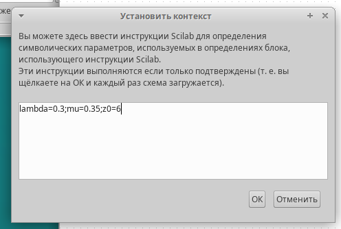
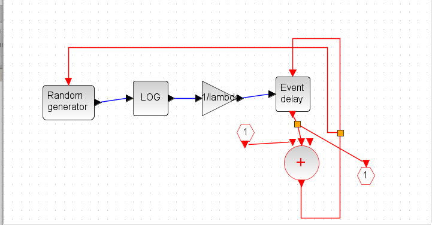
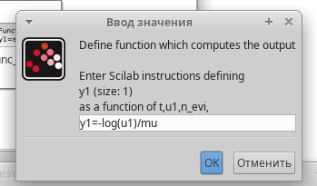
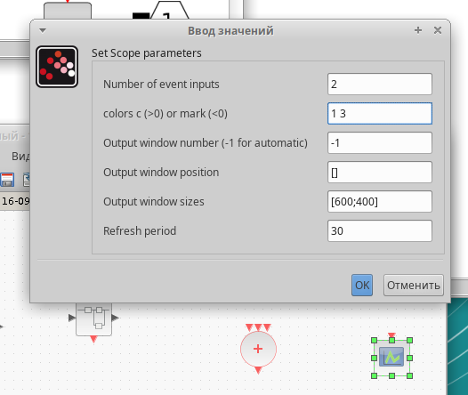
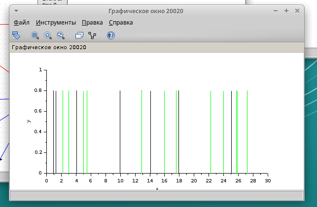

---
## Front matter
title: "Лабораторная работа №7"
subtitle: "Модель M/M/1/"
author: "Чемоданова Ангелина Александровна"

## Generic otions
lang: ru-RU
toc-title: "Содержание"

## Bibliography
bibliography: bib/cite.bib
csl: pandoc/csl/gost-r-7-0-5-2008-numeric.csl

## Pdf output format
toc: true # Table of contents
toc-depth: 2
lof: true # List of figures
lot: false # List of tables
fontsize: 12pt
linestretch: 1.5
papersize: a4
documentclass: scrreprt
## I18n polyglossia
polyglossia-lang:
  name: russian
  options:
	- spelling=modern
	- babelshorthands=true
polyglossia-otherlangs:
  name: english
## I18n babel
babel-lang: russian
babel-otherlangs: english
## Fonts
mainfont: IBM Plex Serif
romanfont: IBM Plex Serif
sansfont: IBM Plex Sans
monofont: IBM Plex Mono
mathfont: STIX Two Math
mainfontoptions: Ligatures=Common,Ligatures=TeX,Scale=0.94
romanfontoptions: Ligatures=Common,Ligatures=TeX,Scale=0.94
sansfontoptions: Ligatures=Common,Ligatures=TeX,Scale=MatchLowercase,Scale=0.94
monofontoptions: Scale=MatchLowercase,Scale=0.94,FakeStretch=0.9
mathfontoptions:
## Biblatex
biblatex: true
biblio-style: "gost-numeric"
biblatexoptions:
  - parentracker=true
  - backend=biber
  - hyperref=auto
  - language=auto
  - autolang=other*
  - citestyle=gost-numeric
## Pandoc-crossref LaTeX customization
figureTitle: "Рис."
tableTitle: "Таблица"
listingTitle: "Листинг"
lofTitle: "Список иллюстраций"
lotTitle: "Список таблиц"
lolTitle: "Листинги"
## Misc options
indent: true
header-includes:
  - \usepackage{indentfirst}
  - \usepackage{float} # keep figures where there are in the text
  - \floatplacement{figure}{H} # keep figures where there are in the text
---

# Цель работы

Исследовать модель Модель M/M/1/$\infty$ с помощью программы *xcos*[@lab].

# Задание

- рассмотреть модель M/M/1/$\infty$ в xcos[@xs];
- построить график поступления и обработки заявок;
- построить график димамики размера очереди.

# Выполнение лабораторной работы

## Теоретическая часть

M|M|1|$\infty$ — однолинейная СМО с накопителем бесконечной ёмкости. Поступающий поток заявок — пуассоновский с интенсивностью λ. Времена обслуживания заявок — независимые в совокупности случайные величины, распределённые по экспоненциальному закону с параметром µ. Рассмотрим реализацию данной модели с параметрами системы: lambda = 0.3 mu = 0.35[@lab_3].

## Реализация модели в xcos

В меню Моделирование, Задать переменные окружения зададим значения переменных. (рис. [-@fig:001]).

{#fig:001 width=70%}

Для реализации модели создадим суперблок моделирования поступления заявок в систему по пуассоновскому закону. (рис. [-@fig:002]).

{#fig:002 width=70%}

Используемые блоки для суперблока, моделирующего постпуление заявок:
- RAND_M -- генератор случайных чисел по равномерному распределению.

- LOGBLCK_f -- взятие логарифма от потока выхода случайных чисел, чтобы получить Пуассоновское распределение.

- GAINBLCK_f -- умножает сгенерированный поток по Пуассоновскому распределению на $- \dfrac{1}{\lambda}$

- EVTGEN_f -- обработчик событий, так как для моделирования заявок будут использованы события.

- CLKSOMV_f -- синхронизация выходных и входных сигналов.

- CLKINV_f -- порт входа в суперблок.

- CLKOUTV_f -- порт выхода из суперблок.

Также создадим суперблок, моделирующий обработку заявок в очереди по экспоненциальному закону. (рис. [-@fig:003]).

{#fig:003 width=70%}

Используемые блоки для суперблока, моделирующего обработку заявок:
- RAND_M -- генератор случайных чисел по равномерному распределению.

- sci_funk_m_block -- задает математическое выражение $y1=-log(u1)/mu$, которое ранее мы задавали блоками. (рис. [-@fig:004]).

- EVTGEN_f -- обработчик событий, так как для моделирования заявок будут использованы события.

- CLKSOMV_f -- синхронизация выходных и входных сигналов. В этом суперблоке их два. 

- IFHEL_f -- два блока для определения длины очереди, если значение больше нуля, то сигнал подается.

- CLKINV_f -- входы для запуска и для сообщения о том, что сообщение пришло в очередь, чтобы по разному обрабатывать пустую и не пустую очередь.

- IN_f, CONST_M -- проверка на длину очереди.

{#fig:004 width=70%}

Реализуем готовую модель M|M|1|$\infty$ в *xcos*. 

Используемые блоки для готовой модели:
- SELECTOR_M -- берёт входные сигналы и с помощью управляющих сигналов будет добавлять вход к очереди, либо считывать. У него три входа -- для поступления заявок, обработки заявок и начальной синхронизации.

- CONST_M -- поступление заявки выражается 1, обслуживание заявки -- -1, первоначальная синхронизация -- 0.

- EVTGEN_f -- запуск первоначального события в нулевой момент времени.

- DOLLAR_f -- блок для иммитации очереди, на него приходит управление, которое синхронизируется с источника и с обработчика. (рис. [-@fig:005]).

- CSCOPE -- для отрисовки длины очереди. (рис. [-@fig:006]).

- CEVEBTSCOPE -- обработка событий. (рис. [-@fig:007]).

{#fig:005 width=70%}

{#fig:006 width=70%}

{#fig:007 width=70%}

Готовая модель M|M|1|$\infty$ в *xcos* (рис. [-@fig:008]).

{#fig:008 width=70%}

После моделирования получим следующие графики(рис. [-@fig:009], [-@fig:010]).

{#fig:009 width=70%}

{#fig:010 width=70%}

# Выводы

Мы исследовали модель Модель M/M/1/$\infty$ с помощью программы *xcos*.

# Список литературы{.unnumbered}

::: {#refs}
:::
