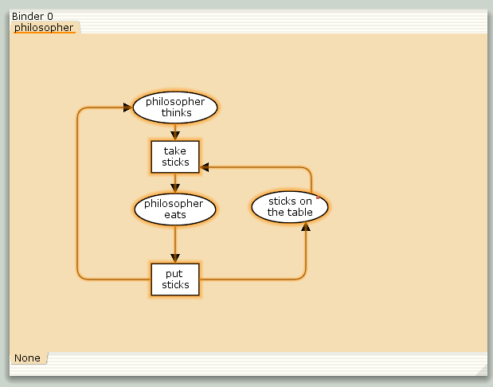
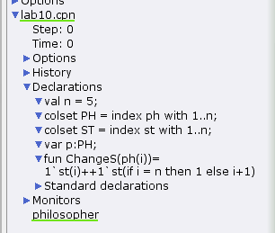
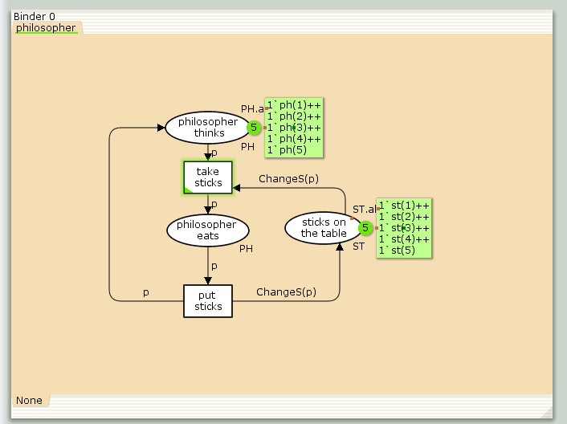
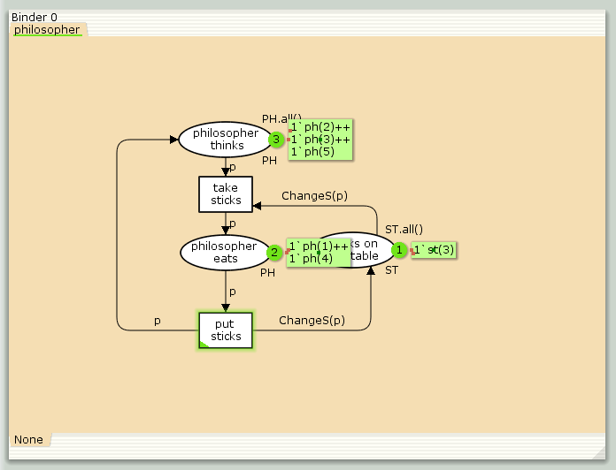
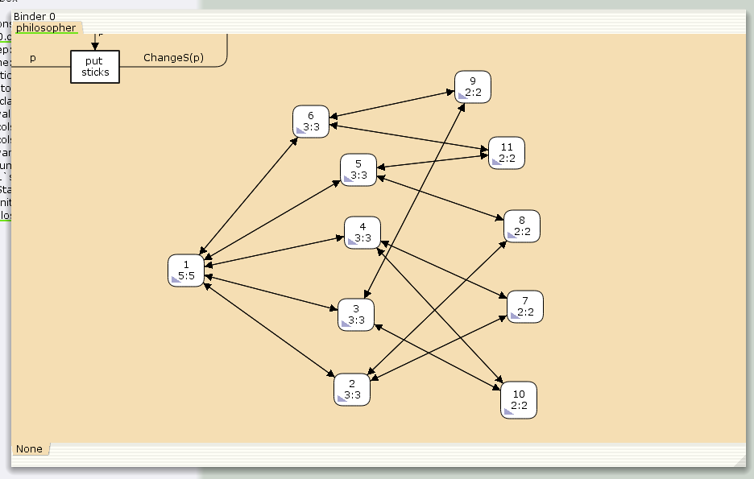

---
## Front matter
lang: ru-RU
title: Лабораторная работа №10
subtitle: "Задача об обедающих мудрецах"
author:
  - Чемоданова Ангелина Александровна
teacher:
  - Кулябов Д. С.
  - д.ф.-м.н., профессор
  - профессор кафедры теории вероятностей и кибербезопасности 
institute:
  - Российский университет дружбы народов имени Патриса Лумумбы, Москва, Россия
date: 25 марта 2025

## i18n babel
babel-lang: russian
babel-otherlangs: english

## Formatting pdf
toc: false
toc-title: Содержание
slide_level: 2
aspectratio: 169
section-titles: true
theme: metropolis
header-includes:
 - \metroset{progressbar=frametitle,sectionpage=progressbar,numbering=fraction}
---

## Докладчик

:::::::::::::: {.columns align=center}
::: {.column width="70%"}

  * Чемоданова Ангелина Александровна
  * Cтудентка НФИбд-02-22
  * Российский университет дружбы народов имени Патриса Лумумбы
  * [1132226443@pfur.ru](mailto:1132226443@pfur.ru)
  * <https://github.com/aachemodanova>

:::
::: {.column width="30%"}


:::
::::::::::::::

## Цель работы

Исследовать задачу об обедающих мудрецах с помощью программы *CPN Tools*.

## Задание

- реализовать задачу об обедающих мудрецах в *CPN Tools*;
- вычислить пространство состояний, сформировать отчет о нем и построить граф.


# Выполнение лабораторной работы

## Задача об обедающих мудрецах

Пять мудрецов сидят за круглым столом и могут пребывать в двух состояниях -- думать и есть. Между соседями лежит одна палочка для еды. Для приёма пищи необходимы две палочки. Необходимо синхронизировать процесс еды так, чтобы мудрецы не умерли с голода.

## Реализация модели в *CPN Tools*

{#fig:001 width=50%}

## Реализация модели в *CPN Tools*

{#fig:002 width=50%}

## Реализация модели в *CPN Tools*

{#fig:003 width=50%}

## Реализация модели в *CPN Tools*

{#fig:004 width=50%}

## Упражнение

{#fig:005 width=70%}

## Упражнение

```
CPN Tools state space report for:
/home/openmodelica/Desktop/lab10.cpn
Report generated: Tue Mar 25 12:06:23 2025

```
## Упражнение

```

 Statistics
------------------------------------------------------------------------

  State Space
     Nodes:  11
     Arcs:   30
     Secs:   0
     Status: Full

  Scc Graph
     Nodes:  1
     Arcs:   0
     Secs:   0

```
## Упражнение

```

 Boundedness Properties
------------------------------------------------------------------------

  Best Integer Bounds
                             Upper      Lower
     philosopher'philosopher_eats 1
                             2          0
     philosopher'philosopher_thinks 1
                             5          3
     philosopher'sticks_on_the_table 1
                             5          1

```
## Упражнение

```
  Best Upper Multi-set Bounds
     philosopher'philosopher_eats 1
                         1`ph(1)++
1`ph(2)++
1`ph(3)++
1`ph(4)++
1`ph(5)
     philosopher'philosopher_thinks 1
                         1`ph(1)++
1`ph(2)++
1`ph(3)++
1`ph(4)++
1`ph(5)
```
## Упражнение

```
     philosopher'sticks_on_the_table 1
                         1`st(1)++
1`st(2)++
1`st(3)++
1`st(4)++
1`st(5)

  Best Lower Multi-set Bounds
     philosopher'philosopher_eats 1
                         empty
     philosopher'philosopher_thinks 1
                         empty
     philosopher'sticks_on_the_table 1
                         empty
```
## Упражнение

```

 Home Properties
------------------------------------------------------------------------

  Home Markings
     All


```
## Упражнение

```

 Liveness Properties
------------------------------------------------------------------------

  Dead Markings
     None

  Dead Transition Instances
     None

  Live Transition Instances
     All

```
## Упражнение

```

 Fairness Properties
------------------------------------------------------------------------
       philosopher'put_sticks 1
                         Impartial
       philosopher'take_stiicks 1
                         Impartial
```

## Выводы

Мы исследовали задачу об обедающих мудрецах с помощью программы *CPN Tools*.
